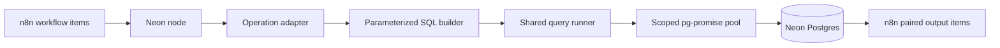

# Neon for n8n

An n8n community node for reading and changing data in a Neon Postgres
database.

[](https://www.npmjs.com/package/n8n-nodes-neon)
[](https://github.com/danishaft/Neon-db-node/actions/workflows/ci.yml)
[](LICENSE)
[](package.json)

The node supports row selection, insertion, update, deletion, schema discovery,
and parameterized SQL. It is intended for self-hosted n8n because the package
uses the `pg-promise` runtime dependency.

## Install

In a self-hosted n8n instance:

1. Open **Settings > Community Nodes**.
2. Choose **Install**.
3. Enter `n8n-nodes-neon`.
4. Restart n8n if the node is not immediately available.

For development:

```bash
git clone https://github.com/danishaft/Neon-db-node.git
cd Neon-db-node
npm install
npm run dev
```

The development command starts n8n at
[`http://localhost:5678`](http://localhost:5678) and links the current node
build.

## Credentials

Copy the connection fields from the Neon console:

- **Host**
- **Port**, normally `5432`
- **Database**
- **Username**
- **Password**
- **SSL**, set to **Require** for Neon

The credential test executes `SELECT 1` and always closes its temporary
connection pool. Connection failures return a bounded message without echoing
the password or connection string.

The **Allow** SSL option exists only for controlled local Postgres development.
Do not use it for a Neon production database.

## Operations

| Operation | Behavior |
| --- | --- |
| Select | Filter, sort, limit, and choose output columns |
| Insert | Auto-map input fields or map columns manually |
| Update | Match rows and update mapped columns |
| Delete | Delete matching rows, truncate, or drop a table |
| Execute query | Run SQL with `$1`, `$2`, and later parameters |

Schema, table, column, and enum metadata are loaded from PostgreSQL system
catalogs and shown in n8n's dynamic controls.

Large `BIGINT` and `NUMERIC` values remain strings. This avoids JavaScript
precision loss and avoids changing PostgreSQL parsers globally for other nodes.

## Query modes

Each incoming n8n item can produce one prepared query.

| Mode | Failure behavior |
| --- | --- |
| Single | Run sequentially and stop on the first error |
| Independent | Run each query and return an error item for individual failures |
| Transaction | Run the complete batch in one transaction and roll back on error |

The transaction mode creates one transaction for the complete item batch, not
one transaction per item.

## Parameter safety

Use query parameters for data:

```sql
SELECT id, email
FROM users
WHERE status = $1 AND created_at >= $2
```

Set **Query Parameters** to the corresponding values. Built-in CRUD operations
use `pg-promise` identifier and value formatting. Filter operators are selected
from a fixed allowlist, so operator text cannot inject SQL.

Custom SQL is intentionally unrestricted. Anyone allowed to edit that n8n node
can run statements permitted by the configured database role. Use a dedicated
least-privilege Neon role.

## Architecture



The n8n node owns dispatch and connection lifetime. Operation modules only
translate n8n parameters into prepared queries. The shared runner owns the three
batch failure contracts.

See [system.md](system.md) for component boundaries, execution sequences,
security, and failure handling.

## Compatibility

The current source has been verified with:

- Node.js `22.22.2`;
- n8n `2.32.6`;
- PostgreSQL `16.14` through a live local n8n workflow;
- the official `@n8n/node-cli` build and lint pipeline.

The local execution used the same PostgreSQL wire protocol and node transport,
but it is not a Neon Cloud compatibility claim. A current Neon Cloud smoke run
remains in [`agent/todo.md`](agent/todo.md).

This package is self-hosted only. It does not meet n8n Cloud's rule against
runtime dependencies because a database driver is required.

## Development

```bash
npm install
npm run format:check
npm run lint
npm test
npm run build
npm pack --dry-run
npm audit --omit=dev --audit-level=high
```

The focused tests protect batch transaction semantics and SQL construction.
They do not mock an n8n workflow and call that integration coverage. Live n8n
execution is a separate release check.

## License

[MIT](LICENSE)
