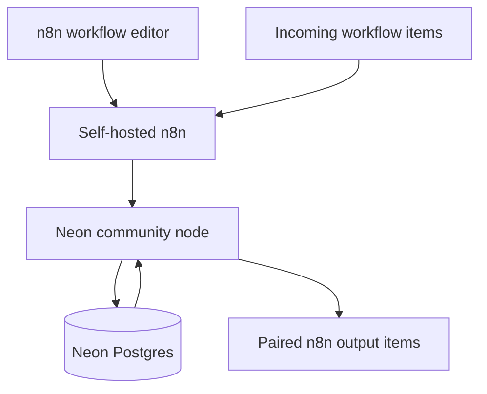
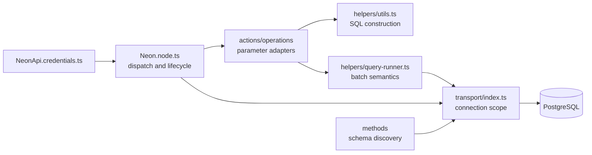
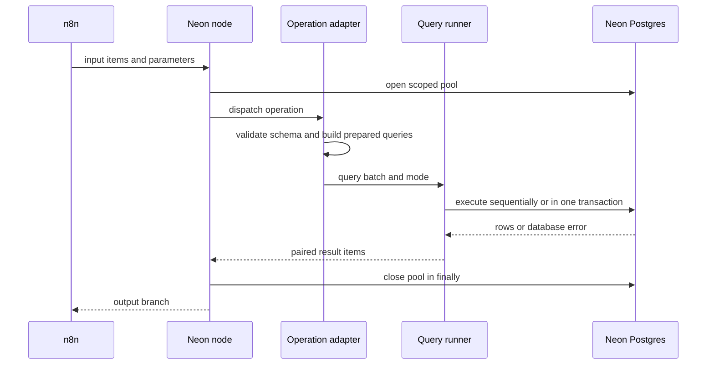
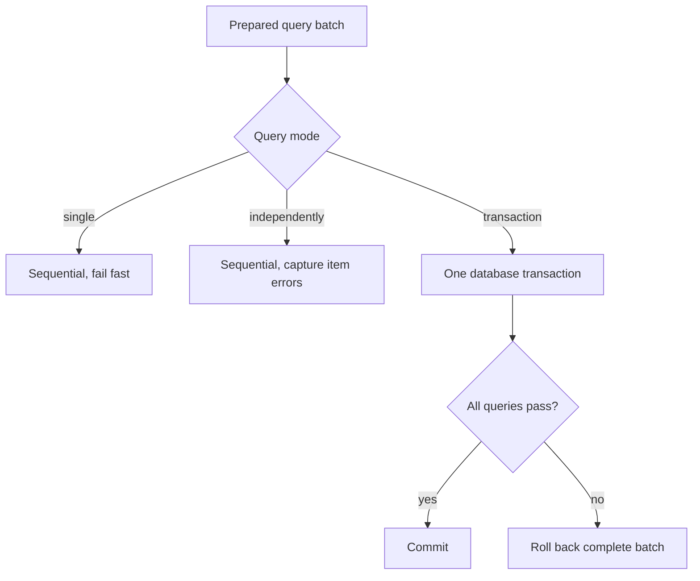
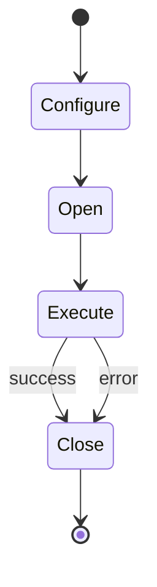

# System design

The Neon community node is an adapter between n8n's item execution model and a
PostgreSQL database. Neon uses the PostgreSQL wire protocol, so connection and
query behavior remain inside a standard `pg-promise` transport.

## System context

n8n stores encrypted credential data and supplies decrypted fields only to the
credential test and node execution contexts. This package does not call the
Neon management API.

## Components

The entry node validates the requested resource and operation, opens one scoped
connection pool, dispatches to an operation, and closes the pool in `finally`.
Metadata methods use the same scoped helper and cannot retain a pool between
credential sets.

## CRUD execution

Every returned row retains `pairedItem.item`, which lets n8n trace output to its
input item.

## Batch modes

Single mode does not imply a transaction. It stops at the first error and leaves
earlier successful statements committed according to PostgreSQL defaults.
Transaction mode is the only all-or-nothing batch contract.

## Metadata discovery

The schema, table, column, and enum methods query PostgreSQL catalogs when n8n
opens a dynamic selector. Each request gets its own scoped connection. Results
are converted to n8n search and resource-mapper shapes after all asynchronous
enum lookups complete.

No metadata cache is shared across credentials. This avoids returning one
database's schema to a node configured with another credential.

## SQL construction

CRUD builders separate:

- identifiers, formatted with `:name`;
- values, passed as query parameters;
- sort directions, produced by n8n option controls;
- filter operators, checked against a fixed allowlist.

The custom query operation accepts SQL by design. Its values are still supplied
separately, but the SQL text has the full permissions of the configured role.

## Connection lifecycle

`pg-promise` initialization is scoped to one execution or metadata request.
There is no process-global pool keyed by mutable credentials. The credential
test uses the same lifecycle.

The pool has a maximum of five connections and a 30-second connection timeout.
Large PostgreSQL numeric types use the driver's safe string representation.

## Error contracts

Credential failures map known network and PostgreSQL authentication codes to
bounded messages. Unknown connection failures do not echo the raw connection
string.

Operation failures become n8n `NodeOperationError` values. Independent mode is
the exception: it emits `{ "error": "..." }` for the failed input and continues
the batch. Workflows must explicitly choose that partial-success contract.

Unsupported resource or operation names fail before database execution.

## Security

The credential password is never logged by this package. Dynamic identifiers
and values are formatted by `pg-promise`; operator strings are allowlisted.

Operational security still depends on n8n and database configuration:

- run this package only in a trusted self-hosted n8n instance;
- require SSL for Neon;
- assign a database role with only the tables and operations the workflow needs;
- restrict who can edit custom SQL nodes;
- keep destructive delete, truncate, and drop operations out of unreviewed
  workflows.

## Design decisions

- Keep one connection lifecycle at the node boundary.
- Keep operation modules responsible for parameter translation only.
- Centralize batch semantics so CRUD operations cannot drift.
- Preserve PostgreSQL numeric precision instead of offering an unsafe number
  conversion.
- Avoid a shared metadata cache until there is evidence it is needed and a safe
  credential-aware key.
- Remain self-hosted rather than hiding the runtime driver to satisfy an
  incompatible n8n Cloud packaging rule.

## Verification boundary

Unit tests exercise one-transaction batch behavior, fail-fast and independent
errors, identifier/value parameterization, and operator rejection. Official n8n
lint and build commands verify node metadata and packaging.

A live n8n `2.32.6` workflow loaded `CUSTOM.neon`, connected through the actual
transport to PostgreSQL `16.14`, inserted `verified-through-n8n`, returned the
row, and completed with status `success`. This verifies n8n discovery and the
PostgreSQL execution path. A separate Neon Cloud run is still required to
verify current TLS, pooler, and hosted compute behavior.
